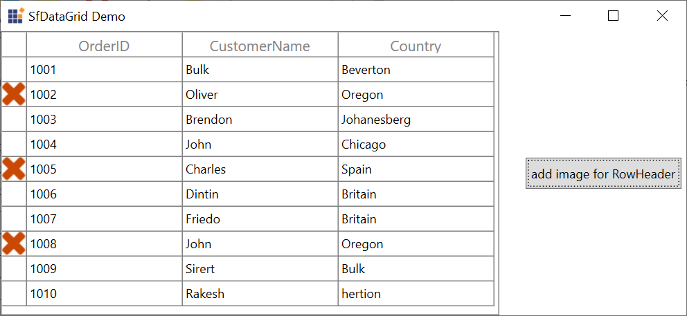

# How to add icon on specific row header of WPF DataGrid(SfDataGrid)?

## About the sample

This sample illustrated that how to add icon on specific row header of [WPF DataGrid](https://www.syncfusion.com/wpf-ui-controls/datagrid) (SfDataGrid).

The [WPF DataGrid](https://www.syncfusion.com/wpf-ui-controls/datagrid) (SfDataGrid) does not provide the direct support to add an image in RowHeader cells. But you can add an image in the RowHeader cell by customizing the [Syncfusion:GridRowHeaderCell](https://help.syncfusion.com/cr/cref_files/wpf/Syncfusion.SfGrid.WPF~Syncfusion.UI.Xaml.Grid.GridRowHeaderCell.html).

```xaml
<Window.Resources>
    <local:RowHeaderConverter x:Key="rowHeaderConverter"/>
    <Style TargetType="syncfusion:GridRowHeaderCell">
        <Setter Property="Template">
            <Setter.Value>
                <ControlTemplate TargetType="syncfusion:GridRowHeaderCell">
                    <Border x:Name="PART_RowHeaderCellBorder"
                    BorderBrush="{TemplateBinding BorderBrush}"
                    BorderThickness="{TemplateBinding BorderThickness}">
                        <Grid>
                            <Image  Source="{Binding IsLocked, Converter={StaticResource rowHeaderConverter}}" />
                        </Grid>
                    </Border>
                </ControlTemplate>                   
            </Setter.Value>
        </Setter>
    </Style>
</Window.Resources>
```

```C#
foreach(var record in datagrid.View.Records)
{
    var data = (record as RecordEntry).Data as OrderInfo;
    if (data.OrderID % 3 == 0)
    {
        //To change the image at run time.
        data.IsLocked = true;
    }
}
```


## Requirements to run the demo
Visual Studio 2015 and above versions
